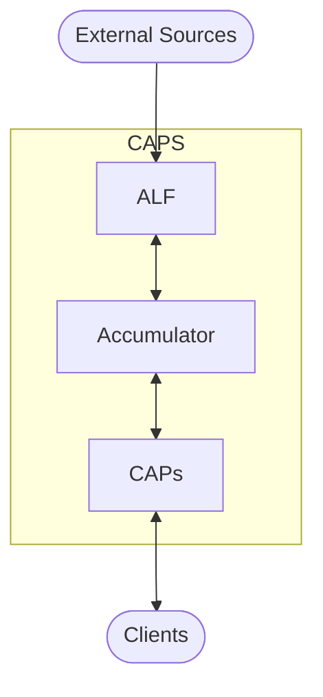

# DCX

<h1> Hello World! </h1>

```python
  pip install pymongo
```


```mermaid
  
  flowchart TB
    
    subgraph CAPS
      ALF <--> Accumulator
      Accumulator <--> CAPs
    end
    
    id1([External Sources]) --> ALF
    CAPs <--> id2([Clients])
   
    click ALF "http://www.google.com.co" "Open this in a new tab" _blank
    
  
```
